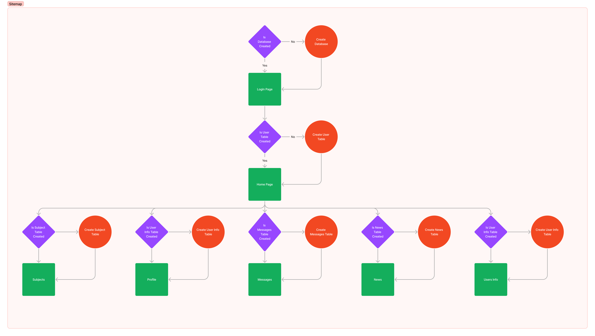

# A project for SQL training on real application

The project is going to use the following technologies/structure:
* Type: Web
* Prototype: Figma
* Frontend: Vanilla Typescript/tsc
* Backend: Express-ts(Node)
* DB: MySql/PLSQL
* Server: Apache HTTPD

## Prototype:
* Sitemap:

The complete sitemap structure can be seen on [Figma](https://www.figma.com/file/pobqfrfTquNX0VYcDFw5qL/Database-Webserver?type=whiteboard&node-id=0-1&t=RaRdvMhaHKXtfwpz-0).

* Prototype:
TO-DO

## Frontend:
TO-DO

## Backend:
TO-DO

## DB:
TO-DO

## Server:
TO-DO
